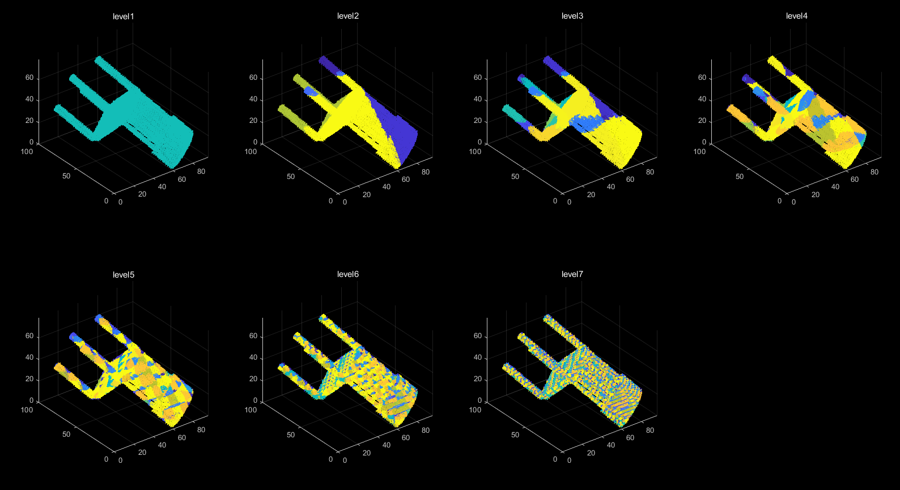

# PointCloud-Octree-Compression

Matlab code for PointCloud Octree Compression.

This is a lossless point cloud compression MATLAB demo based on the octree occupancy (BFS) and arithmetic coding.

Algorithm description is in the OctreeAlgorithm.pdf.

